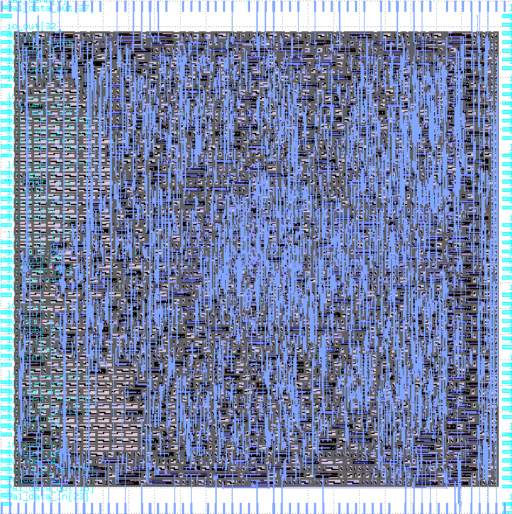

# Zero to ASIC Group submission MPW6

This ASIC was designed by members of the [Zero to ASIC course](https://zerotoasiccourse.com).

This submission was configured and built by the [multi project tools](https://github.com/mattvenn/multi_project_tools) at commit [0b7bd3b2334a6c2b3846e0691daa829e7c8500d6](https://github.com/mattvenn/multi_project_tools/commit/0b7bd3b2334a6c2b3846e0691daa829e7c8500d6).

    # clone all repos, and include support for shared OpenRAM
    ./multi_tool.py --clone-repos --clone-shared-repos --create-openlane-config --copy-gds --copy-project --openram

    # run all the tests
    ./multi_tool.py --test-all --force-delete

    # build user project wrapper submission
    cd $CARAVEL_ROOT; make user_project_wrapper

    # create docs
    ./multi_tool.py --generate-doc --annotate-image

# Project Index

## Function generator

* Author: Matt Venn
* Github: https://github.com/mattvenn/wrapped_function_generator
* commit: 701095fd880ad3bb80d6cec1d214a04e5676a65d
* Description: arbitary function generator, using shared RAM as the output data

## Cpr Assistant

* Author: Zorkan ERKAN
* Github: https://github.com/zorkan/cpr
* commit: 4e4c41917683f00b41689a5baa02fdd8e6fe70e1
* Description: Professional CPR Assistant. Support AHA Standarts

## instrumented adder - behavioural

* Author: Matt Venn & Teo
* Github: https://github.com/mattvenn/wrapped_instrumented_adder_behav
* commit: 1137c249d415544fb85e101a12fa156940fe5cfa
* Description: adds a precise timer to optimised hardware adders to measure how fast they are

## instrumented adder - sklansky

* Author: Matt Venn & Teo
* Github: https://github.com/mattvenn/wrapped_instrumented_adder_sklansky
* commit: 1137c249d415544fb85e101a12fa156940fe5cfa
* Description: adds a precise timer to optimised hardware adders to measure how fast they are

## instrumented adder - brent

* Author: Matt Venn & Teo
* Github: https://github.com/mattvenn/wrapped_instrumented_adder_brent
* commit: 1137c249d415544fb85e101a12fa156940fe5cfa
* Description: adds a precise timer to optimised hardware adders to measure how fast they are

## instrumented adder - ripple

* Author: Matt Venn & Teo
* Github: https://github.com/mattvenn/wrapped_instrumented_adder_ripple
* commit: 1137c249d415544fb85e101a12fa156940fe5cfa
* Description: adds a precise timer to optimised hardware adders to measure how fast they are

## instrumented adder - kogge

* Author: Matt Venn & Teo
* Github: https://github.com/mattvenn/wrapped_instrumented_adder_kogge
* commit: 1137c249d415544fb85e101a12fa156940fe5cfa
* Description: adds a precise timer to optimised hardware adders to measure how fast they are

